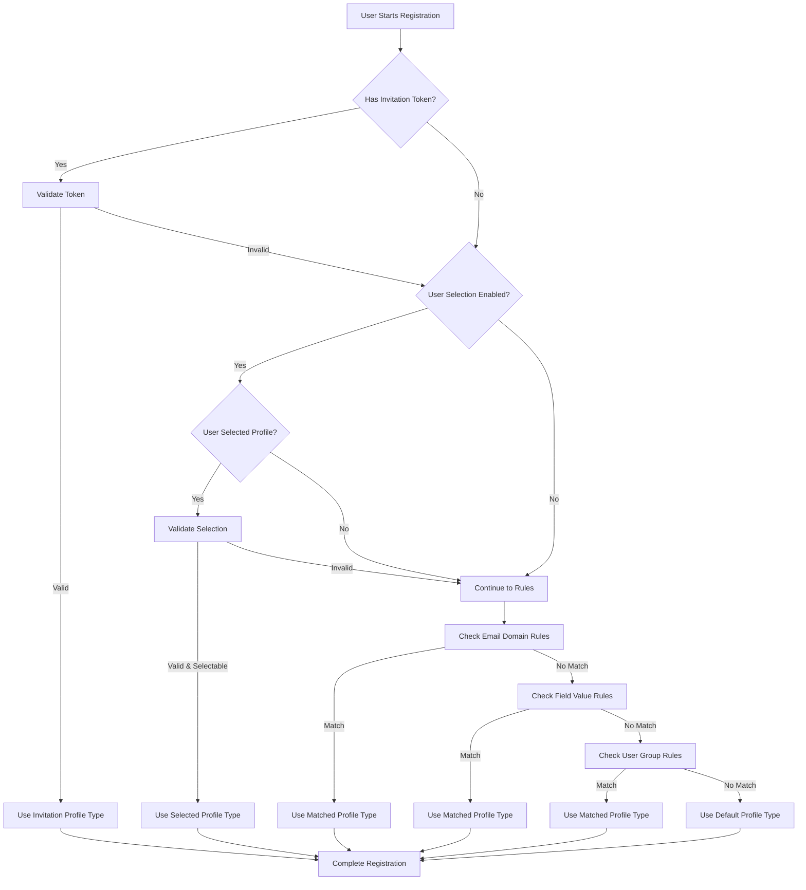

# Profile Assignment Rules

Sociable provides a powerful profile assignment system that automatically assigns the appropriate profile type to users during registration. This feature is essential when your community has different user segments (e.g., Teachers/Students, Buyers/Sellers, Freelancers/Clients) that require different profile configurations.

## Overview

The profile assignment system supports multiple assignment methods that work together with a priority-based resolution:

| Priority | Method | Description |
|----------|--------|-------------|
| 1 (Highest) | User Selection | User selects their profile type during registration |
| 2 | Invitation Token | Profile type from invitation link |
| 3 | Email Domain | Based on user's email domain |
| 4 | Field Value | Based on registration form field values |
| 5 | User Group | Based on Joomla user group membership |
| 6 (Lowest) | Default | Falls back to the default profile type |

When a user registers, Sociable evaluates these methods in priority order and assigns the first matching profile type.

## Assignment Modes

Each profile type can have one of three assignment modes configured in its settings:

| Mode | Description |
|------|-------------|
| **Manual** | Profile type can only be assigned by administrators |
| **Automatic** | Profile type is assigned based on assignment rules only |
| **Selectable** | Users can choose this profile type during registration |

To make a profile type available for user selection:

1. Go to **Components → Sociable → Profile Types**
2. Edit the profile type
3. Set **Assignment Mode** to "Selectable"
4. Save changes

:::tip
Only profile types marked as "Selectable" appear in the registration form's profile type dropdown. This prevents users from selecting internal or restricted profile types.
:::

## Setting Up Assignment Rules

### Accessing Assignment Rules

1. Go to **Components → Sociable → Profile Types**
2. Click the **Assignment Rules** tab
3. Here you can view, create, edit, and delete assignment rules

### Creating a New Rule

1. Click **New Rule** in the toolbar
2. Configure the rule:

| Field | Description |
|-------|-------------|
| **Profile Type** | The profile type to assign when this rule matches |
| **Rule Type** | Type of rule (Email Domain, User Group, or Field Value) |
| **Value** | The matching criteria (depends on rule type) |
| **Priority** | Higher numbers are evaluated first (0-100) |
| **Published** | Enable or disable the rule |

3. Click **Save** to create the rule

## Rule Types

### Email Domain Rules

Automatically assign profile types based on the user's email domain. Perfect for educational institutions, organizations, or B2B scenarios.

**Configuration:**

| Field | Value Example | Description |
|-------|--------------|-------------|
| Rule Type | Email Domain | |
| Value | `university.edu` | Email domain to match |

**Wildcard Support:**

- `*.university.edu` - Matches any subdomain (math.university.edu, cs.university.edu)
- `company.com` - Exact domain match only

**Use Cases:**

| Scenario | Domain Rule | Profile Type |
|----------|-------------|--------------|
| University students | `*.edu` | Student |
| Company employees | `company.com` | Employee |
| Partner organizations | `partner.org` | Partner |

**Example:** Assign "Teacher" profile to users with `@school.edu` emails:

```
Rule Type: Email Domain
Value: school.edu
Profile Type: Teacher
Priority: 10
```

### User Group Rules

Assign profile types based on Joomla user group membership. Useful when you control user group assignment through other means (SSO, third-party plugins, manual assignment).

**Configuration:**

| Field | Value Example | Description |
|-------|--------------|-------------|
| Rule Type | User Group | |
| Value | `8` | Joomla User Group ID |

**Finding User Group IDs:**

1. Go to **Users → Groups**
2. Click on the group name
3. The ID is visible in the URL or browser address bar

**Example:** Assign "Premium" profile to users in the "Subscribers" group (ID: 8):

```
Rule Type: User Group
Value: 8
Profile Type: Premium
Priority: 5
```

### Field Value Rules

Match against custom field values submitted during registration. Enables complex conditional assignment based on user-provided information.

**Configuration:**

| Field | Value Example | Description |
|-------|--------------|-------------|
| Rule Type | Field Value | |
| Value | `role` | Custom field name |
| Expected Value | `freelancer` | Value to match |
| Match Type | `exact` | How to compare values |

**Match Types:**

| Type | Description | Example |
|------|-------------|---------|
| `exact` | Exact string match | "teacher" matches "teacher" only |
| `contains` | Substring match | "teacher" matches "math teacher" |
| `regex` | Regular expression | `^(teacher|professor)$` |
| `any` | Any non-empty value | Matches if field has any value |

**Example:** Assign "Freelancer" profile based on a registration field:

```
Rule Type: Field Value
Value: occupation
Expected Value: freelancer
Match Type: exact
Profile Type: Freelancer
Priority: 8
```

## Priority System

When multiple rules could match a user, the priority system determines which profile type is assigned:

1. **Higher priority numbers take precedence** (100 > 50 > 0)
2. Rules are evaluated in descending priority order
3. The first matching rule wins
4. If no rules match, the default profile type is used

**Best Practices:**

- Use priority ranges for different rule types:
  - 80-100: Critical/specific rules
  - 50-79: Standard assignment rules
  - 20-49: Fallback rules
  - 0-19: Low-priority defaults

**Example Priority Setup:**

| Rule | Priority | Reason |
|------|----------|--------|
| Admin emails (admin@company.com) | 100 | Override all other rules |
| Partner organizations | 80 | Specific business partners |
| Email domain (.edu) | 50 | General institutional users |
| User group based | 30 | Supplementary assignment |
| Default | 0 | Catch-all |

## Invitation System

Invitations allow administrators to send registration links that automatically assign specific profile types. This is ideal for:

- Onboarding new team members
- Inviting users to specific roles
- Controlled registration processes
- Tracking referral sources

### Managing Invitations

Access the invitation management interface:

1. Go to **Components → Sociable** and click the **Invitations** menu item in the left sidebar
2. View existing invitations and their usage statistics

### Creating Invitations

**Single Invitation:**

1. Click **New Invitation**
2. Configure:
   | Field | Description |
   |-------|-------------|
   | **Email** | Recipient's email address |
   | **Profile Type** | Profile type to assign |
   | **Max Uses** | Maximum times the link can be used (0 = unlimited) |
   | **Expires At** | Expiration date (leave empty for no expiration) |
   | **Notes** | Internal notes about this invitation |
3. Click **Save**
4. Optionally click **Send Email** to email the invitation

**Bulk Invitations:**

1. Click **Bulk Create**
2. Enter multiple email addresses (one per line)
3. Select the profile type
4. Configure max uses and expiration
5. Click **Create & Send**

### Invitation Link Format

Invitation links follow this format:

```
https://yoursite.com/index.php?option=com_sociable&view=register&invitation=TOKEN
```

Where `TOKEN` is a unique 32-character alphanumeric string.

### Invitation Statuses

| Status | Description |
|--------|-------------|
| **Active** | Invitation can be used |
| **Expired** | Past expiration date |
| **Exhausted** | Max uses reached |
| **Revoked** | Manually disabled |

### Tracking Invitation Usage

View invitation usage details:

1. Click on an invitation in the list
2. View the **Usage** tab to see:
   - Users who registered with this invitation
   - Registration dates
   - IP addresses (for security)

## Registration Flow Integration

When a user registers through Sociable, the system follows this process:



### Enabling User Selection

To allow users to choose their profile type during registration:

1. Go to **Components → Sociable → Settings → Registration**
2. Enable **Allow Profile Type Selection**
3. Ensure desired profile types have **Assignment Mode** set to "Selectable"

When enabled, the registration form displays a dropdown with all selectable profile types.

## Frontend Registration Form

When profile assignment features are configured, the registration form automatically adapts:

**With User Selection Enabled:**

```html
<form>
  <!-- Standard fields -->
  <input type="text" name="name" placeholder="Full Name" />
  <input type="email" name="email" placeholder="Email" />
  <input type="password" name="password" placeholder="Password" />
  
  <!-- Profile Type Selection (if enabled) -->
  <select name="profile_type_id">
    <option value="1">Student</option>
    <option value="2">Teacher</option>
    <option value="3">Professional</option>
  </select>
  
  <button type="submit">Register</button>
</form>
```

**With Invitation Token:**

The profile type dropdown is hidden/disabled, and the invitation's profile type is used automatically.

## API Reference

### ProfileAssignmentService

The `ProfileAssignmentService` handles profile type resolution during registration.

**Resolving Profile Type:**

```php
use Joomla\CMS\Factory;

$container = Factory::getContainer();
$assignmentService = $container->get(\Jeremymarc\Component\Sociable\Administrator\Service\ProfileAssignmentService::class);

// Get resolved profile type during registration
$profileTypeId = $assignmentService->resolveProfileTypeForRegistration(
    userEmail: 'student@university.edu',
    selectedProfileTypeId: null,
    invitationToken: null,
    registrationData: ['occupation' => 'student'],
    userGroups: []
);
```

**Managing Assignment Rules:**

```php
// Get all rules
$rules = $assignmentService->getAssignmentRules();

// Get rules for a specific profile type
$rules = $assignmentService->getAssignmentRules([
    'profile_type_id' => 2,
    'rule_type' => 'email_domain',
    'published' => 1,
]);

// Create a new rule
$ruleId = $assignmentService->createAssignmentRule([
    'profile_type_id' => 2,
    'rule_type' => 'email_domain',
    'rule_value' => 'university.edu',
    'priority' => 50,
    'published' => 1,
]);

// Update a rule
$assignmentService->updateAssignmentRule($ruleId, [
    'priority' => 75,
]);

// Delete a rule
$assignmentService->deleteAssignmentRule($ruleId);
```

### InvitationService

The `InvitationService` manages invitation tokens.

```php
use Joomla\CMS\Factory;

$container = Factory::getContainer();
$invitationService = $container->get(\Jeremymarc\Component\Sociable\Administrator\Service\InvitationService::class);

// Create an invitation
$invitation = $invitationService->createInvitation([
    'email' => 'newuser@example.com',
    'profile_type_id' => 2,
    'max_uses' => 1,
    'expires_at' => '2025-12-31 23:59:59',
    'notes' => 'VIP onboarding',
]);

// Get invitation URL
$url = $invitationService->getInvitationUrl($invitation['token']);

// Send invitation email
$invitationService->sendInvitationEmail($invitation['id']);

// Validate a token
$validInvitation = $invitationService->getValidInvitation('abc123token');

// Record usage after registration
$invitationService->recordInvitationUse(
    invitationId: $invitation['id'],
    userId: $newUserId
);
```

### REST API Endpoints

**Assignment Rules:**

| Method | Endpoint | Description |
|--------|----------|-------------|
| GET | `/api/sociable/profile-types/assignment-rules` | List all rules |
| GET | `/api/sociable/profile-types/assignment-rules/{id}` | Get single rule |
| POST | `/api/sociable/profile-types/assignment-rules` | Create rule |
| PUT | `/api/sociable/profile-types/assignment-rules/{id}` | Update rule |
| DELETE | `/api/sociable/profile-types/assignment-rules/{id}` | Delete rule |
| GET | `/api/sociable/profile-types/rule-types` | Get available rule types |

**Invitations:**

| Method | Endpoint | Description |
|--------|----------|-------------|
| GET | `/api/sociable/invitations` | List invitations |
| GET | `/api/sociable/invitations/{id}` | Get invitation details |
| POST | `/api/sociable/invitations` | Create invitation |
| POST | `/api/sociable/invitations/bulk` | Create multiple invitations |
| PUT | `/api/sociable/invitations/{id}` | Update invitation |
| DELETE | `/api/sociable/invitations/{id}` | Delete invitation |
| POST | `/api/sociable/invitations/{id}/send-email` | Send invitation email |
| GET | `/api/sociable/invitations/validate/{token}` | Validate token |

## Database Schema

### Assignment Rules Table

```sql
CREATE TABLE `#__sociable_profile_assignment_rules` (
  `id` int(11) NOT NULL AUTO_INCREMENT,
  `profile_type_id` int(11) NOT NULL,
  `rule_type` varchar(50) NOT NULL,
  `rule_value` varchar(255) NOT NULL,
  `rule_params` json DEFAULT NULL,
  `priority` int(11) NOT NULL DEFAULT 0,
  `published` tinyint(1) NOT NULL DEFAULT 1,
  `created` datetime NOT NULL DEFAULT CURRENT_TIMESTAMP,
  `created_by` int(11) DEFAULT NULL,
  `modified` datetime DEFAULT NULL,
  `modified_by` int(11) DEFAULT NULL,
  PRIMARY KEY (`id`),
  KEY `idx_profile_type` (`profile_type_id`),
  KEY `idx_rule_type` (`rule_type`),
  KEY `idx_priority` (`priority` DESC),
  KEY `idx_published` (`published`)
);
```

### Invitations Table

```sql
CREATE TABLE `#__sociable_invitations` (
  `id` int(11) NOT NULL AUTO_INCREMENT,
  `email` varchar(255) DEFAULT NULL,
  `profile_type_id` int(11) NOT NULL,
  `token` varchar(64) NOT NULL,
  `max_uses` int(11) NOT NULL DEFAULT 1,
  `use_count` int(11) NOT NULL DEFAULT 0,
  `expires_at` datetime DEFAULT NULL,
  `notes` text DEFAULT NULL,
  `published` tinyint(1) NOT NULL DEFAULT 1,
  `created` datetime NOT NULL DEFAULT CURRENT_TIMESTAMP,
  `created_by` int(11) DEFAULT NULL,
  PRIMARY KEY (`id`),
  UNIQUE KEY `idx_token` (`token`),
  KEY `idx_email` (`email`),
  KEY `idx_profile_type` (`profile_type_id`)
);
```

## Troubleshooting

### Users Assigned Wrong Profile Type

1. Check rule priorities - higher priority rules override lower ones
2. Verify rule conditions match the expected values
3. Check if user selection is enabled and user chose a different type
4. Review invitation token if registration used one

### Email Domain Rules Not Matching

1. Ensure the email domain is entered without the `@` symbol
2. Check for typos in the domain name
3. Verify the rule is published
4. Check wildcards: `*.edu` matches subdomains, `edu` does not

### Invitation Links Not Working

1. Verify the invitation hasn't expired
2. Check if max uses has been reached
3. Ensure the invitation is published (not revoked)
4. Confirm the token in the URL matches the database

### Rules Tab Not Visible

1. Ensure you have administrator permissions
2. Clear Joomla cache
3. Check for JavaScript errors in browser console

## Best Practices

1. **Start with email domain rules** - They're the most reliable for institutional users
2. **Use high priorities for exceptions** - Admin or VIP users should use priority 90+
3. **Test before going live** - Use the preview feature to test rule resolution
4. **Document your rules** - Use the notes field to explain why rules exist
5. **Monitor invitation usage** - Regular review prevents abuse
6. **Set expiration dates** - Don't leave invitations open indefinitely
7. **Use single-use invitations** - For maximum security, set max_uses to 1

## Next Steps

- [Configuring User Profiles](configuring-multiple-profiles-in-sociable) - Set up profile types and fields
- [Enable Referrals](enable-referrals-in-sociable) - Set up the referral system
- [SDK Developer Guide](sociable-sdk-developer-guide) - Build custom integrations
